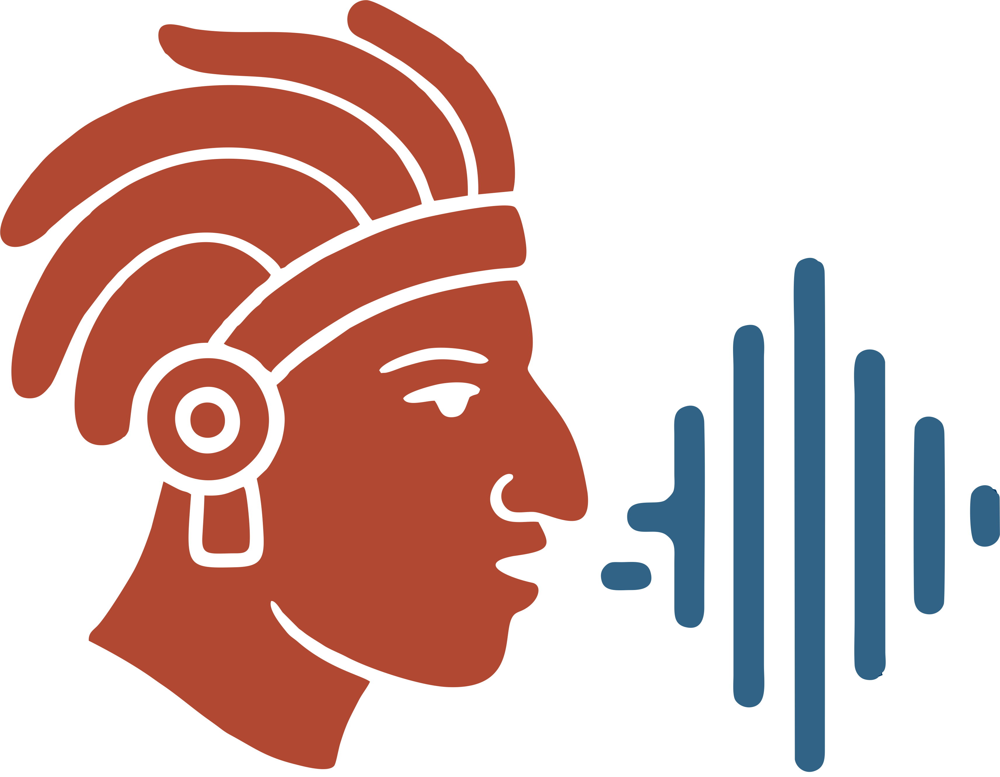

<div align="center">



# Kinai

### Tecnología de voz para el maya yucateco

<p><strong>Un laboratorio abierto para investigar y construir un asistente de voz en maya yucateco.</strong></p>

[](https://github.com/Mauriciocr207/kinai/actions/workflows/docs.yml)
[](https://github.com/Mauriciocr207/kinai/actions/workflows/chatbot.yml)
[](pyproject.toml)
[](https://huggingface.co/mau-cr/mayan_best_model)
[](https://huggingface.co/mau-cr/mms-tts-yua-6voces)
[](https://huggingface.co/spaces/mau-cr/asr-maya-yucateco)
[](https://asr-maya-chatbot.netlify.app)

</div>

## ✨ En una frase

Kinai reúne investigación, datos, modelos, herramientas, aplicaciones y experimentos en un solo laboratorio para avanzar hacia un asistente de voz en maya yucateco.

```text
🎙️ audio → 🧠 ASR → 💬 respuesta → 🔊 TTS → 🎧 audio
```

El proyecto nace de una tesis sobre reconocimiento automático del habla, pero su alcance actual es más amplio: construir tecnología de voz reutilizable, documentada y culturalmente responsable.

## 🚀 Pruébalo ahora

| Recurso | Qué puedes hacer |
|---|---|
| [💬 Chatbot Kinai](https://asr-maya-chatbot.netlify.app) | Hablar en maya yucateco y conversar con el prototipo |
| [🎙️ Demo ASR](https://huggingface.co/spaces/mau-cr/asr-maya-yucateco) | Subir o grabar audio y obtener una transcripción |
| [🤗 Modelo ASR](https://huggingface.co/mau-cr/mayan_best_model) | Descargar y utilizar el mejor modelo publicado |
| [🔊 Modelo TTS](https://huggingface.co/mau-cr/mms-tts-yua-6voces) | Explorar síntesis de voz con seis voces |
| [📦 Dataset](https://huggingface.co/datasets/mau-cr/mayan-voice) | Consultar el corpus restringido y solicitar acceso |

## 🧪 Qué hay dentro

| Área | Estado | Enlace |
|---|---|---|
| 🎙️ Corpus y anotaciones | Activo; parte privada | [`projects/corpus`](projects/corpus/README.md) |
| 🧠 ASR maya yucateco | Modelos publicados | [`docs/models/asr.md`](docs/models/asr.md) |
| 🔊 TTS maya yucateco | Modelo publicado; integración en validación | [`docs/models/tts.md`](docs/models/tts.md) |
| 📊 Análisis lingüístico y acústico | Activo | [`projects/analysis`](projects/analysis/README.md) |
| 💬 Aplicación chatbot | Prototipo funcional | [`apps/chatbot`](apps/chatbot/README.md) |
| ⚡ Inferencia en edge/Hailo | Experimental | [`projects/hailo`](projects/hailo/README.md) |
| 🗃️ Pipeline Kaldi | Archivado | [`projects/legacy/kaldi_asr`](projects/legacy/kaldi_asr/README.md) |

## 🗺️ Explorar el laboratorio

- [🌱 Visión general de KINAI Lab](docs/overview.md)
- [📍 Estado actual y prioridades](docs/status.md)
- [🏗️ Arquitectura del laboratorio](docs/architecture.md)
- [🧠 Documentación del ASR](docs/models/asr.md)
- [🔊 Documentación del TTS](docs/models/tts.md)
- [🗄️ Almacenamiento y Google Drive](docs/storage.md)
- [📚 Tesis e investigación de origen](docs/research/thesis.md)
- [🤖 Trabajo con agentes](docs/development/working-with-agents.md)
- [🤝 Guía para contribuir](CONTRIBUTING.md)

## ⚙️ Instalación rápida

### Herramientas de investigación

```bash
./tools/install_system_deps.sh
uv sync
uv run ytclip where
```

La aplicación web tiene su propio entorno Node y sus instrucciones en [`apps/chatbot`](apps/chatbot/README.md).

### Ejecutar el chatbot

```bash
cd apps/chatbot
npm install
npm run dev
```

Las credenciales de Anthropic y Hugging Face deben configurarse como secretos del entorno server-side. Nunca las guardes en el frontend, `localStorage` ni el repositorio.

## 🧭 Organización

```text
apps/       aplicaciones y demos desplegables
packages/   código reutilizable
projects/   investigación, pipelines y experimentos
data/       datos pequeños, manifiestos y derivados autorizados
docs/       conocimiento común, estado y decisiones
examples/   ejemplos mínimos de ASR, TTS y asistente
tools/      dependencias y utilidades externas
```

Git contiene código, notebooks, manifiestos y documentación. Google Drive conserva material privado o pesado. Hugging Face aloja modelos y datasets publicados. Consulta [`docs/storage.md`](docs/storage.md) antes de añadir datos o artefactos grandes.

## 🤖 Colaboración con agentes

KINAI está preparado para trabajar con Orca, Codex, Claude Code y otras herramientas agenticas:

```text
agente trabajador → rama → Pull Request → CI → agente maestro → main
```

Los agentes no modifican directamente `main`. El agente maestro revisa cambios, validaciones, documentación y riesgos; los cambios sobre datos, licencias, privacidad, publicaciones o resultados científicos requieren revisión humana.

Lee [`AGENTS.md`](AGENTS.md) antes de trabajar en el repositorio.

Consulta la [guía práctica para usar herramientas agenticas](docs/development/using-agentic-tools.md) para instalar una herramienta, trabajar en una rama y abrir un PR.

## 🔒 Datos y responsabilidad

El foco actual es el maya yucateco (`yua`). El corpus permanece restringido por ahora. Que un archivo exista localmente, en Google Drive o en Hugging Face no implica autorización para redistribuirlo.

Cada modelo, dataset y experimento debe documentar procedencia, permisos, versión, limitaciones y nivel de reproducibilidad.

## 📜 Investigación

La documentación de la tesis que originó KINAI se conserva en [`docs/research/thesis.md`](docs/research/thesis.md). Los detalles operativos de cada línea de trabajo viven en su respectivo README dentro de `projects/`.

## 🌞 Nombre

**Kinai** nace de la unión de *K’iin* —día y sol en maya yucateco— con **AI**, inteligencia artificial. El nombre representa el propósito de poner la inteligencia artificial al servicio de la tecnología de voz en maya yucateco. La plataforma es el laboratorio; el asistente de voz es el horizonte.
