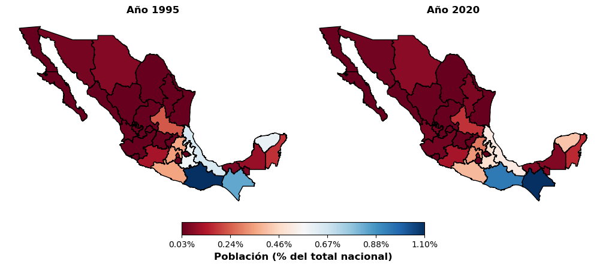

# Introducción

La lengua **Maya Yucateca (Maayat'aan)** es la variante indígena más hablada en México, pero
atraviesa un proceso sostenido de desplazamiento hacia el español que debilita su transmisión
intergeneracional. Los esfuerzos de revitalización la entienden hoy como una **lengua viva** que
debe reconstruirse como parte de una identidad postcolonial, y en ese marco la Inteligencia
Artificial (IA) y el Procesamiento del Lenguaje Natural (NLP) abren rutas concretas.

*Aunque la población hablante de lengua indígena creció en números absolutos, su porcentaje
respecto a la población nacional disminuyó (INEGI, 1995–2020).*

## Problemática

De los ~7,000 idiomas del mundo, la investigación en NLP se concentra en apenas una veintena.
El resto —lenguas sin corpus anotados ni herramientas computacionales— queda sistemáticamente
fuera del ecosistema digital. **El Maya Yucateco ocupa ese lugar**: tiene una comunidad de
hablantes activa, pero carece de los recursos mínimos para que los sistemas modernos de ASR
puedan adaptarse a ella.

El problema **no es la inexistencia de datos**, sino la falta de un proceso sistemático que los
integre, segmente y organice en un **corpus público, estructurado y reproducible**. Tanto los
modelos *end-to-end* como los híbridos basados en HMM requieren audio alineado con su
transcripción; sin ese recurso, no es posible construir un sistema funcional.

## Hipótesis

> Un corpus **modesto** del Maya Yucateco, debidamente segmentado a nivel de enunciado, es
> suficiente para describir computacionalmente la lengua y para alcanzar tasas de error
> competitivas al ajustar un modelo E2E preentrenado en miles de idiomas.

## Objetivos

**General.** Construir un corpus de audio en lengua Maya Yucateca y demostrar su utilidad para
caracterizar la lengua y entrenar modelos modernos de reconocimiento del habla.

**Específicos:**

1. **Recolectar y organizar** grabaciones de fuentes de libre acceso, garantizando diversidad de hablantes.
2. **Analizar** estadística, léxica y acústicamente el corpus (frecuencias, comportamiento léxico, espacio vocálico).
3. **Explorar** la segmentación automática mediante alineación forzada con Kaldi.
4. **Evaluar** la utilidad del corpus con el ajuste fino de `mms-1b-all`, trazando la curva de WER vs. volumen de audio.
5. **Cuantificar** el aporte de un modelo de lenguaje de *n*-gramas sobre las salidas del ASR.

## Justificación

- **Viabilidad técnica:** el umbral de datos para un ASR funcional ya está dentro de lo razonable
  para el maya, gracias a modelos multilingües preentrenados como `mms-1b-all`.
- **Alcance:** el mismo flujo es transferible a **otras lenguas indígenas mexicanas** en
  condiciones similares de escasez de recursos.
- **Pertinencia:** construir infraestructura lingüística digital es una contribución concreta a los
  procesos de revitalización que lleva a cabo la comunidad maya-hablante.
