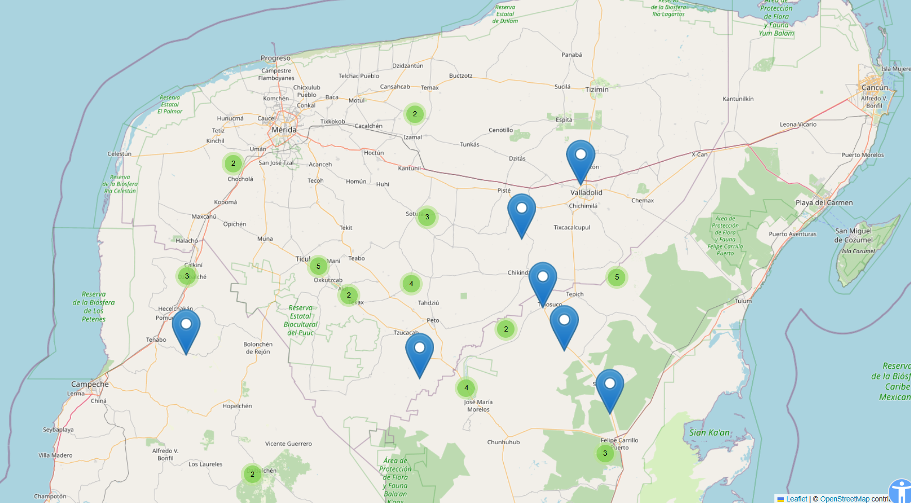
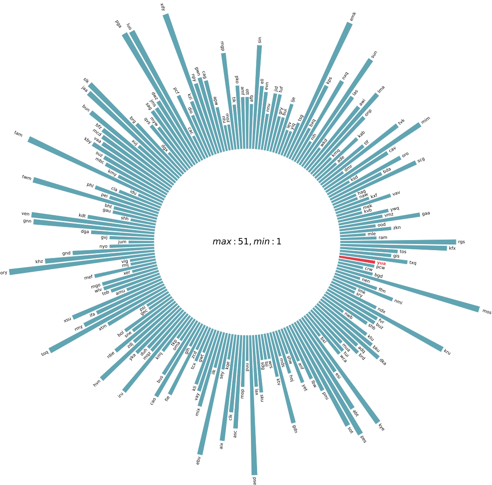

# Antecedentes

El desarrollo de ASR para lenguas de bajos recursos se apoya en **dos frentes**: la construcción
de corpus y la adaptación de modelos preentrenados.

## Corpus para lenguas en peligro

Iniciativas locales como el **corpus T'aantsil** documentan el maya yucateco a partir de hablantes
nativos, articulando conocimiento comunitario con ingeniería de corpus y NLP.

*Documentación de campo del corpus T'aantsil en la península de Yucatán.*

A escala global, el proyecto **Scaling Speech Technology to 1000+ Languages** de Meta introdujo
**MMS-unlab**, reconstruido y ampliado por el proyecto **XEUS** como **MMS-ulab-v2**: ~8,900 horas
de audio no etiquetado en 4,023 lenguas de 189 familias lingüísticas, orientado al aprendizaje de
representaciones acústicas.

*MMS ofrece reconocimiento y síntesis de voz para 1,107 lenguas y detección de idioma para 4,017.*

## Flujo de procesamiento en ASR

El trabajo en ASR de bajos recursos sigue dos vertientes:

- **Enfoque clásico (híbrido DNN/HMM):** genera modelos ligeros y de baja demanda computacional,
  pero requiere recursos lingüísticos específicos (diccionarios fonéticos, corpus de texto).
  Herramientas como **Kaldi** y el **Montreal Forced Aligner** son representativas.
- **Ajuste fino de modelos preentrenados (estado del arte):** modelos autosupervisados como
  **Wav2Vec 2.0**, **MMS** o **XLS-R** se adaptan a nuevas lenguas con mucho menos audio transcrito.

### Evidencia en lenguas de bajos recursos

| Trabajo | Lengua | Resultado |
|---|---|---|
| Mainzinger & Levow (2024) | Mvskoke (< 300 hablantes) | WER **37 %** con adaptadores sobre MMS-1B |
| Bartley & Ragni (2025) | Manés y córnico | WER **< 50 %** con apenas **40 min** de audio |
| Klejch et al. (2025) | Gaélico escocés | El **híbrido** superó a Whisper afinado cuando hay texto abundante |
| Zhao & Zhang (2022) | 15 lenguas de bajos recursos | Resultados competitivos con **~10 h** etiquetadas |

La lección recurrente: **la cantidad de datos no determina por sí sola el desempeño**; la
complejidad fonológica y la distancia respecto a las lenguas de preentrenamiento pesan tanto o más.

## Panorama en el Maya Yucateco

La investigación reciente en IA para el maya incluye:

- **Mayasoundex** (Molina-Villegas, 2024): adaptación del algoritmo Soundex a la fonología maya;
  acertó el **85 %** de palabras mal escritas frente al 15.6 % de un corrector convencional.
- **Bancos de similitud semántica** adaptados de la lista de Swadesh para evaluar *embeddings*.
- **Herramientas de estado finito** (Pugh et al., 2023): analizador morfológico y corrector
  ortográfico sensible a la morfología.
- **Traducción automática** Chol/Maya–Español con modelos multilingües.
- Descripciones **fonéticas y fonológicas** del maya y otras lenguas mayences (tono, glotalización,
  espacio vocálico).

A pesar de estos avances, **ningún recurso público constituía por sí solo un corpus de audio
segmentado utilizable** para entrenar ASR moderno — la brecha que este trabajo aborda.
