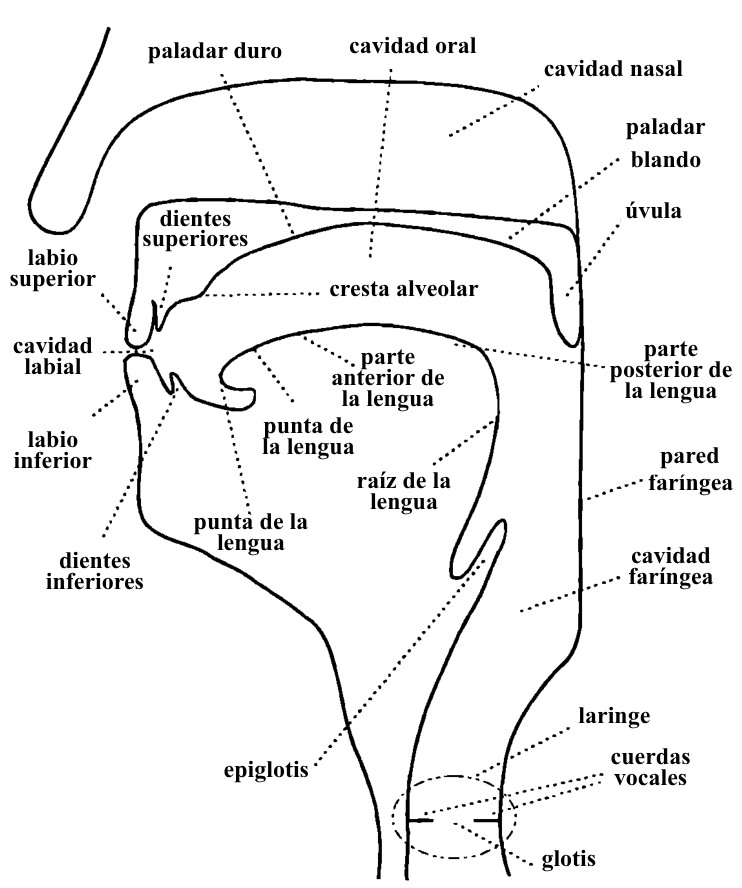
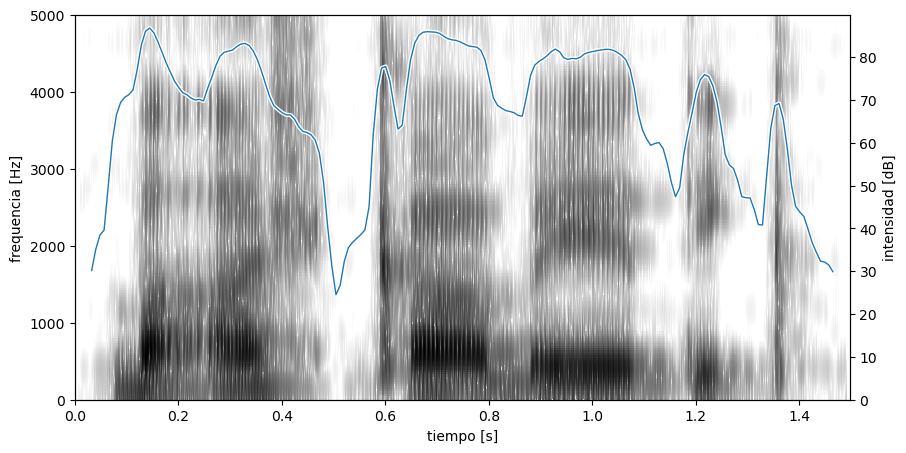
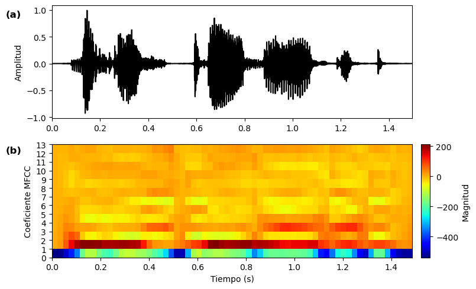
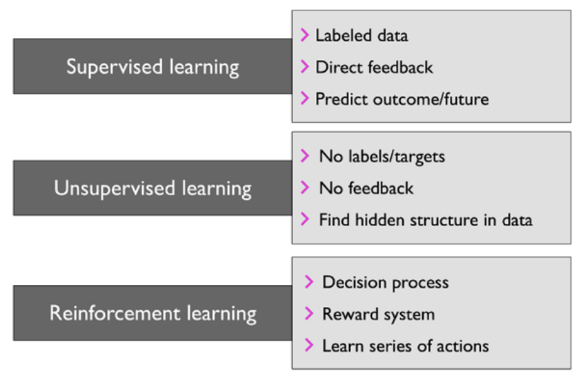
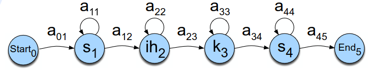
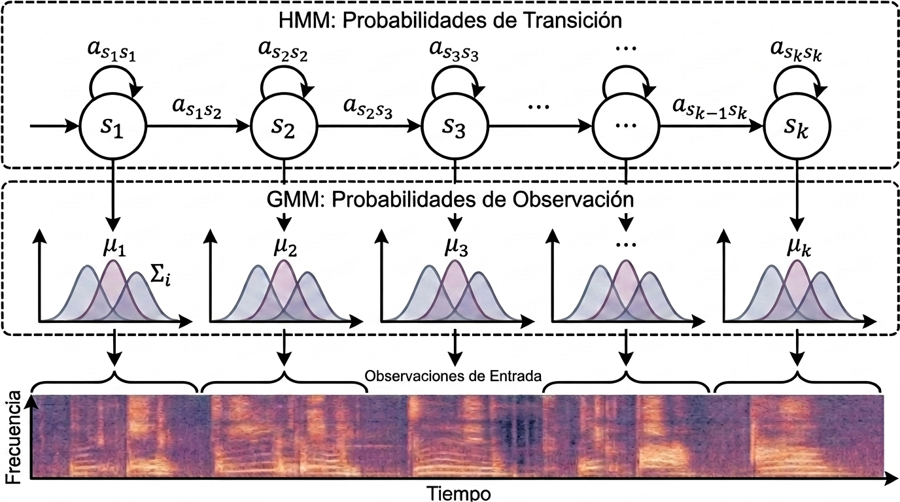
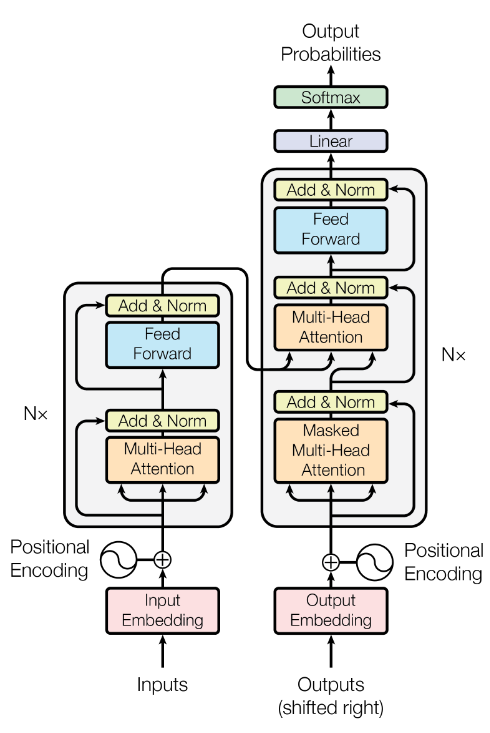
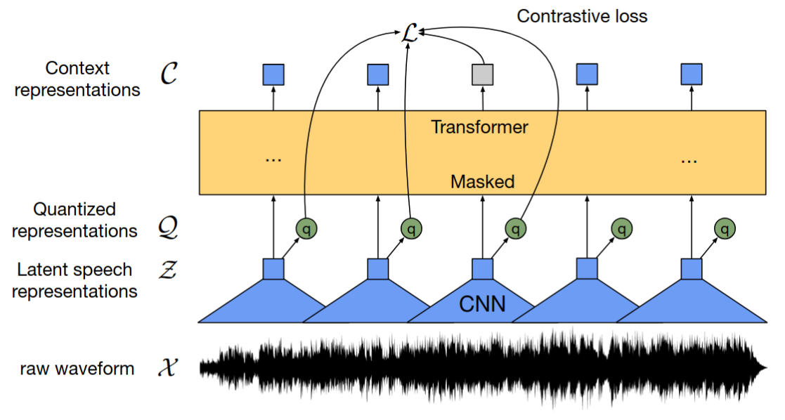

# Marco teórico

Este capítulo recorre, de forma condensada, los fundamentos que sostienen el trabajo: del **sonido
y la fonética** al **aprendizaje profundo** y el **reconocimiento de voz**.

## 1. Naturaleza física del sonido y fonética

El sonido surge de fluctuaciones de presión en un medio. Las ondas pueden ser **periódicas**
(con una frecuencia fundamental **F0** que da el tono) o **aperiódicas** (ruido).

El habla se produce en el **aparato fonador**: el sistema respiratorio aporta energía, la **laringe**
actúa como fuente sonora (vibración de las cuerdas vocales) y el **tracto vocal** funciona como un
resonador ajustable que da forma a cada sonido.

*Componentes del aparato fonador (Bickford & Floyd, 2006).*

Los sonidos se clasifican por su **punto** y **modo de articulación** (oclusivas, nasales,
fricativas, africadas, aproximantes…) y, en el caso de las vocales, por altura, avance y
redondeamiento. El **Alfabeto Fonético Internacional (IPA)** estandariza su representación
(ver [Anexos](./06-anexos.md)).

## 2. La lengua Maya Yucateca

El maya yucateco conserva los rasgos esenciales del sistema fonológico **proto-maya**: oclusivas y
africadas con sus contrapartes **glotalizadas**, una **oclusiva glotal** independiente, y cinco
vocales con distinción de longitud.

Es además una **lengua tonal** (Tono Alto / Tono Bajo), con tres tipos vocálicos —largas, breves y
rearticuladas— donde la duración se relaciona con el tono. Su sistema consonántico distingue
fonemas como `p'`, `t'`, `k'`, `ts'`, `ch'` y la glotal `'`.

## 3. Procesamiento digital de señales de audio

La voz se digitaliza muestreando la señal analógica a una **frecuencia de muestreo** `f_s`. Para
analizar su contenido en frecuencia se usa la **Transformada de Fourier**, calculada eficientemente
con la **FFT**.

*Espectrograma de la frase en maya "Ba'ax ka beetik" (¿Qué haces?): representación
tiempo–frecuencia–intensidad.*

Para el ASR, la voz se modela como **fuente × filtro** (cuerdas vocales × tracto vocal). Separar
ambas componentes motiva los **Coeficientes Cepstrales en Frecuencias de Mel (MFCC)**, que aplican
una escala perceptual (Mel) y resumen el espectro en ~13 coeficientes por trama.

*Extracción de MFCC: la representación de entrada típica para modelos acústicos clásicos.*

El **análisis acústico de la voz** se centra en la frecuencia fundamental **F0** (tono) y los
**formantes F1, F2, F3** (resonancias del tracto vocal que identifican las vocales): F1 se
correlaciona con la altura de la lengua y F2 con su posición antero-posterior.

## 4. Fundamentos de Inteligencia Artificial

El **aprendizaje automático** agrupa sus algoritmos en tres paradigmas: **supervisado** (con
etiquetas), **no supervisado** (descubrir estructura) y **por refuerzo** (prueba y error).

*Principales paradigmas del aprendizaje automático.*

- El **perceptrón** es la unidad supervisada más simple: ajusta pesos para reducir el error.
- **K-Means** agrupa datos no etiquetados; su calidad se evalúa con métricas internas
  (**Silhouette, Calinski-Harabasz, Davies-Bouldin**) y el **método del codo** — herramientas que
  este trabajo usa para inferir el espacio vocálico.
- El **aprendizaje profundo** apila capas de neuronas con activaciones no lineales (ReLU), entrenadas
  con **descenso de gradiente** y **backpropagation**.

## 5. Reconocimiento de voz (ASR)

El ASR convierte voz en texto combinando un **modelo acústico** y un **modelo de lenguaje**.

### Enfoque clásico: HMM-GMM

Durante décadas el estándar fue el pipeline **HMM-GMM**: el **Modelo Oculto de Markov (HMM)** aporta
la estructura temporal (cada fonema ≈ un HMM de tres estados) y la **Mezcla de Gaussianas (GMM)**
modela la variabilidad acústica de cada estado.

*HMM para la palabra "six": estados ocultos y probabilidades de transición.*

*El HMM-GMM asigna probabilidades a pares (audio, transcripción), apoyado por un modelo de lenguaje
de n-gramas (p. ej. con **KenLM**) y herramientas como **Kaldi**.*

### Transición al aprendizaje profundo

El **GMM** se reemplazó primero por redes profundas (DNN-HMM); luego las RNN/LSTM y la pérdida
**CTC** eliminaron la necesidad de alineamiento explícito; finalmente, el **mecanismo de atención**
y los **Transformers** se volvieron la base del estado del arte.

*El Transformer prescinde de la recurrencia y se basa en atención multi-cabeza.*

### Modelos End-to-End modernos

- **Wav2Vec 2.0** — aprende de audio **sin etiquetar** (preentrenamiento autosupervisado con pérdida
  contrastiva) y se ajusta con muy poco audio transcrito. Es la base de la familia **MMS** usada en
  este trabajo.

*wav2vec 2.0: codificador convolucional + Transformer + cuantización.*

- **Whisper** — apuesta por la **escala** (680,000 h supervisadas) para lograr robustez *zero-shot*.

La familia **MMS** (Meta) ajusta Wav2Vec 2.0 sobre 1,406 lenguas para producir un único modelo capaz
de transcribir 1,107 idiomas — el punto de partida del ajuste fino de este proyecto.
