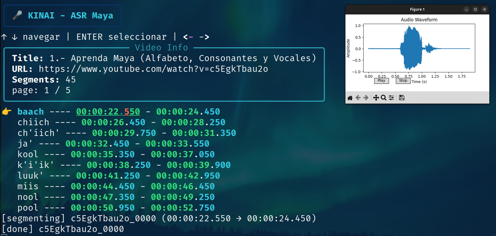

# Metodología

El trabajo es **íntegramente computacional** y se desarrolló en **cuatro etapas encadenadas**:
construcción del corpus, análisis lingüístico-acústico, alineamiento forzado y ajuste fino de un
modelo E2E.

## Materiales

**Fuentes de datos** (audio en maya):

| Fuente | Aporte | Estado |
|---|---|---|
| **Narraciones Mayas de Campeche (INALI)** | ~3 h de relatos bilingües con audio alineado | ✅ Usada (dominio conversacional) |
| **YouTube** | ~1 h de videos en maya | ✅ Usada (lectura en voz alta) |
| **Grabaciones propias** | hablantes nativos, 20 frases comunes | ✅ Usada (material controlado) |
| Global Recordings Network | 43 min sin transcripción | ❌ Descartada |
| MMS-ulab-v2 | solo 2 muestras `yua` (redundantes) | ❌ Descartada |

**Software:** Python 3.11 con `librosa` y `parselmouth` (Praat) para análisis acústico; `numpy`,
`pandas`, `matplotlib`, `scikit-learn` para datos y clustering; `yt-dlp` y `FFmpeg` para
recolección; `transformers` y `huggingface-hub` para entrenar y publicar el modelo.

**Cómputo:** Google Colab con GPUs NVIDIA **A100 SXM4 (80 GB)** y **RTX PRO 6000 Blackwell**.

## Diseño general del pipeline

```
Fuentes de audio ─► [1] Construcción ─► [2] Análisis ─► [3] Alineamiento ─► [4] Ajuste fino MMS
   (INALI,           (segmentación,      (léxico +        (Kaldi,            (mms-1b-all +
    YouTube,          transcripción)      acústico)        forced align)      LM 3-gramas)
    propias)
```

## Etapa 1 · Construcción del corpus

Se desarrolló una **herramienta CLI en Python** (sobre `FFmpeg` y `yt-dlp`) para extraer, segmentar
y asociar transcripciones; permite visualizar la forma de onda, reproducir cada corte y ajustar los
límites antes de guardarlo. Las Narraciones de Campeche se fragmentaron con **detección de actividad
de voz (VAD)**.


*CLI para recorte y descarga de segmentos de audio desde YouTube.*

Cada video se describe en una base de datos JSON:

```json
{
  "url": "[url de youtube]",
  "title": "[identificador]",
  "segments": [
    {
      "maya": "baach",          // palabra en maya
      "spanish": "chachalaca",  // traducción
      "start": "00:00:22.550",  // inicio
      "end": "00:00:24.450",    // fin
      "spk_id": "spk_001"       // hablante
    }
  ]
}
```

El resultado son **dos subcorpus complementarios**: uno con múltiples hablantes y enunciados cortos,
y otro centrado en relatos narrativos continuos.

## Etapa 2 · Análisis del corpus

Sobre los enunciados segmentados se calcularon:

- **Estadísticas** de hablantes, duración y distribución por género.
- **Análisis léxico:** verificación de la **ley de Zipf** (`f(r) ∝ 1/r^α`) y mapas de
  combinación consonante–vocal.
- **Cadenas de Markov** de transición **Vocal–Consonante–Glotal** (la glotal es un rasgo distintivo del maya).
- **Análisis acústico:** extracción de **F0, F1, F2**; el espacio vocálico se infiere con **k-Means**
  sobre segmentos abiertos y aireados (sin necesidad de etiquetas fonéticas), validando $k$ con tres
  métricas (Silhouette, Calinski-Harabasz, Davies-Bouldin) y el método del codo (`k = 3`).

## Etapa 3 · Alineamiento forzado con Kaldi

Los pares texto-audio se prepararon para entrenar modelos **monófono y trífono** en Kaldi, buscando
generar alineaciones a nivel de **fonema** para segmentar automáticamente grabaciones largas. Sin
embargo, **la modesta cantidad de audio no fue suficiente** para obtener resultados aceptables; la
línea queda abierta (con Vosk/TDNN para inferencia en tiempo real) para trabajo futuro.

## Etapa 4 · Ajuste fino de `mms-1b-all`

El modelo se ajustó **incrementalmente** con porciones crecientes del corpus (de **20 a 240 min**, en
pasos de 20), midiendo el **WER** sobre un conjunto de prueba constante. Se añadió una capa
decodificadora con un **modelo de lenguaje de 3-gramas** (KenLM) entrenado solo sobre las
transcripciones de entrenamiento.

**División del dataset:**

| Split | Duración (min) | Muestras | Hablantes |
|---|---|---|---|
| Entrenamiento | 229.9 | 2116 | restantes |
| Validación | 14.8 | 152 | `spk_009`, `spk_0029` |
| Test | 24.2 | 267 | `spk_002`, `spk_020`, `spk_024`, `spk_028` |

Los hablantes se eligieron por *split* para **priorizar el balance de género** en la evaluación.
