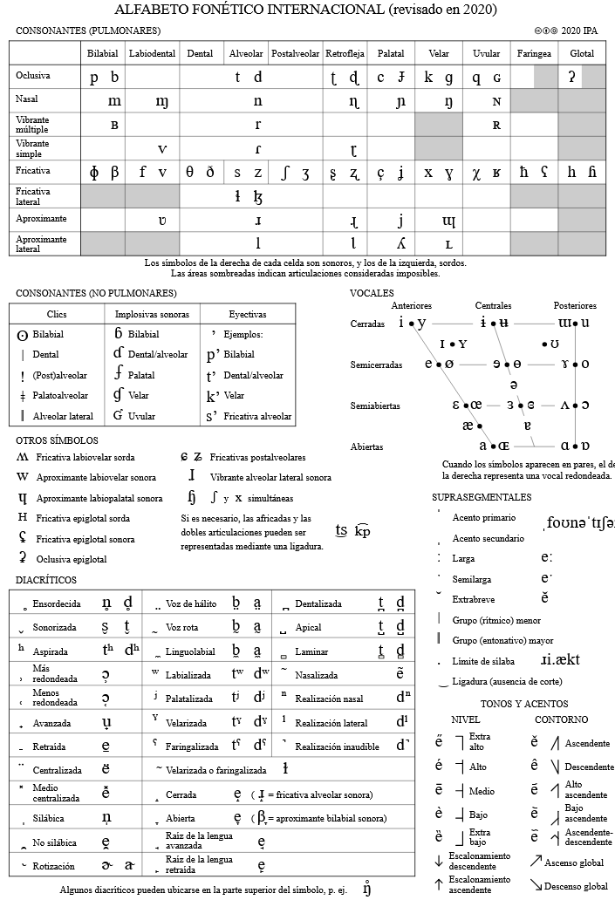

# Anexos y recursos

## Recursos públicos del proyecto

| Recurso | Enlace |
|---|---|
| 🎤 Demo conversacional (KINAI) | [Abrir demo](/) |
| 🤗 Modelo ASR (Hugging Face Space) | [asr-maya-yucateco](https://huggingface.co/spaces/mau-cr/asr-maya-yucateco) |
| 📦 Corpus de audio (dataset) | [mau-cr/mayan-voice](https://huggingface.co/datasets/mau-cr/mayan-voice) |
| 💻 Código y pipeline | [github.com/Mauriciocr207/thesis-mayan-ai](https://github.com/Mauriciocr207/thesis-mayan-ai) |

## Alfabeto Fonético Internacional (IPA)

La descripción fonética de este trabajo se apoya en el Alfabeto Fonético Internacional, que
estandariza la representación de los sonidos del habla.

*Cuadro oficial del IPA en español (revisión 2020).*

## Sistema consonántico del maya yucateco

Según las *Normas de Escritura para la Lengua Maya* (INALI, 2017):

| Modo \ Punto | Bilabial | Alveolar | Postalveolar | Palatal | Velar | Glotal |
|---|---|---|---|---|---|---|
| Nasal | m | n | | | | |
| Oclusiva | p, b | t | | | k | ' |
| Oclusiva glotalizada | p' | t' | | | k' | |
| Fricativa | | s | x (ʃ) | | | j |
| Africada | | ts | ch | | | |
| Africada glotalizada | | ts' | ch' | | | |
| Aproximante | w | | | y | | |
| Lateral | | l | | | | |

## Bibliografía selecta

- Pratap, V., et al. (2023). *Scaling Speech Technology to 1,000+ Languages* (MMS). arXiv:2305.13516.
- Baevski, A., et al. (2020). *wav2vec 2.0: A Framework for Self-Supervised Learning of Speech Representations.* arXiv:2006.11477.
- Chen, W., et al. (2024). *Towards Robust Speech Representation Learning for Thousands of Languages* (XEUS). arXiv:2407.00837.
- Mainzinger, J., & Levow, G.-A. (2024). *Fine-Tuning ASR models for Very Low-Resource Languages: A Study on Mvskoke.* ACL SRW.
- Bartley, C., & Ragni, A. (2025). *How I Built ASR for Endangered Languages with a Spoken Dictionary.* arXiv:2510.04832.
- Romero, M., Gómez-Canaval, S., & Torre, I. G. (2024). *Automatic Speech Recognition Advancements for Indigenous Languages of the Americas.* Applied Sciences, 14(15), 6497.
- Molina-Villegas, A. (2024). *Mayasoundex: A Phonetically Grounded Algorithm for Information Retrieval in the Maya Language.* LXAI at NAACL 2024.
- Vaswani, A., et al. (2023). *Attention Is All You Need.* arXiv:1706.03762.
- INALI (2017). *Normas de Escritura en Lenguas Indígenas Nacionales — Maya.*

:::info
La bibliografía completa (≈ 40 referencias) está en la tesis original. Aquí se incluye una selección
representativa de las fuentes centrales del proyecto.
:::
