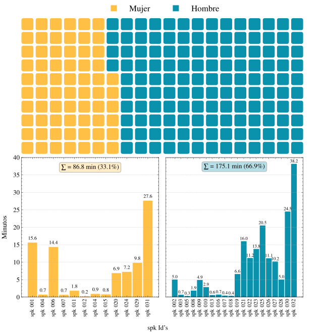
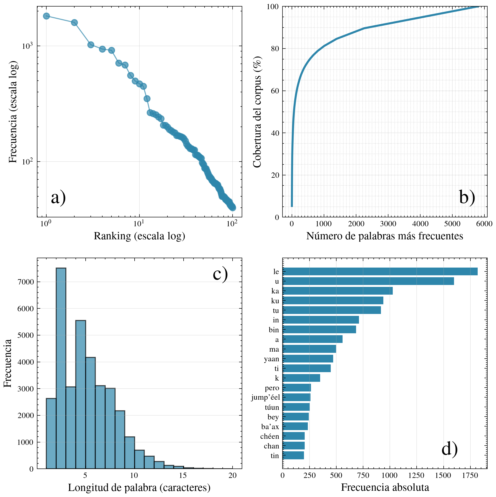
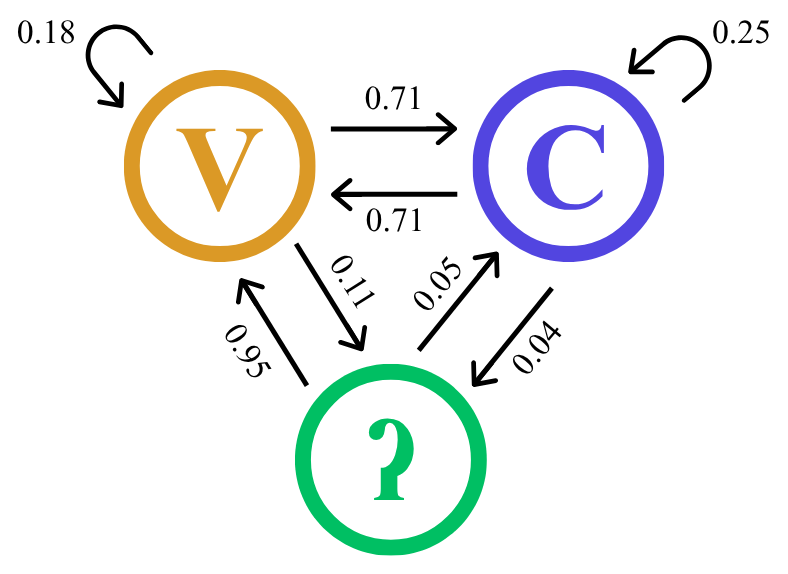
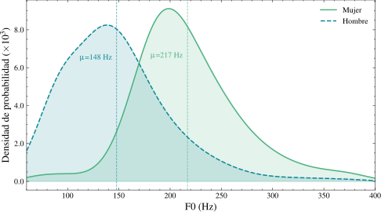
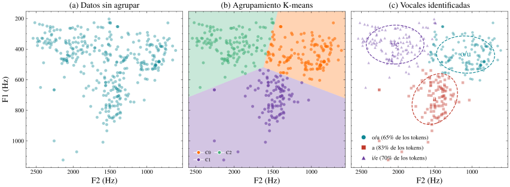
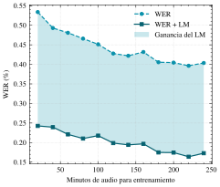

# Resultados y discusión

## Estadísticas del corpus

El corpus construido alcanzó **4 h 21 min 52 s** de audio, repartidos entre **32 hablantes** y
**2,535 enunciados** segmentados, con segmentos de entre **2 y 15 segundos**. Las grabaciones cubren
dos dominios: **conversacional** (Narraciones de Campeche) y **lectura en voz alta** (YouTube +
grabaciones propias), lo que aporta variabilidad de ritmo, prosodia y estilo.

La distribución por género está **desbalanceada**: **33.1 %** mujeres (86.8 min) frente a **66.9 %**
hombres (175.1 min) — un sesgo habitual en corpus de lenguas indígenas que conviene tener presente al
entrenar.

*Minutos de audio por hablante y proporción de género en el corpus.*

## Análisis del vocabulario

Las transcripciones reúnen **34,154 palabras**, de las cuales **5,802 son únicas**. Al ordenarlas por
frecuencia aparece el comportamiento típico de la **ley de Zipf**: unas pocas formas concentran la
mayoría de las apariciones y una larga cola de palabras ocurre solo una o dos veces.

*(a) Ley de Zipf, (b) cobertura acumulada, (c) distribución de longitud de palabra y (d) palabras más frecuentes.*

Modelando el maya como transiciones **Vocal–Consonante–Glotal** con una cadena de Markov, la
transición **glotal → glotal tiene probabilidad cero**: la glotal nunca se repite sobre sí misma,
sino que siempre se enlaza con una vocal o consonante — un resultado que **valida la calidad** del
corpus.

*Cadena de Markov de transición entre vocal (V), consonante (C) y glotal (?).*

## Análisis acústico

Sobre los audios es posible modelar los formantes **F0, F1 y F2** y caracterizar cada voz. Separando
la **frecuencia fundamental F0** por género, los hombres promedian **148 Hz** y las mujeres
**217 Hz**, valores consistentes con la literatura.

*Distribución del tono fundamental (F0) para hombres y mujeres.*

Para localizar las vocales en el plano **F1–F2**, sin etiquetas fonéticas, se detectaron las
secciones aireadas y abiertas y se aplicó **k-Means**. Tres métricas internas coinciden en `k = 3`,
y las regiones resultantes corresponden a las vocales **a**, **i/e** y **o/u**, reproduciendo el
conocido **triángulo vocálico**.

*Datos crudos → agrupamiento k-Means → vocales identificadas (elipses de confianza).*

## Ajuste fino de `mms-1b-all`

Como aplicación directa del corpus, se ajustó `mms-1b-all` con cantidades crecientes de audio. Los
resultados son **alentadores incluso con poco material**:

- Con **20 min** → WER ≈ **53 %**.
- Con **240 min** → WER ≈ **40 %**.
- Añadiendo el **modelo de lenguaje de 3-gramas**, la ganancia llega a **30 puntos porcentuales**,
  bajando el WER hasta **≈ 17 %**.

*WER frente a minutos de entrenamiento; el área sombreada es la ganancia del LM de 3-gramas.*

## Discusión

Los resultados se alinean con lo reportado para ASR de bajos recursos: **pocas decenas de minutos**
bastan para cruzar el umbral del 50 % de WER, y el **modelo de lenguaje** aporta una mejora que
**rivaliza con la del modelo acústico**. Aun así, el mejor resultado (≈ 40 % sin LM, ≈ 17 % con LM)
permanece lejos del desempeño en lenguas con grandes corpus: la **fonología del maya** y su
**distancia** respecto a las lenguas de preentrenamiento de MMS probablemente acotan la mejora
alcanzable. Las principales limitaciones son el **desbalance de género** y la **concentración del
material** narrativo en pocos hablantes.

:::note Pruébalo
El modelo está disponible en
[Hugging Face](https://huggingface.co/spaces/mau-cr/asr-maya-yucateco) y en el
**[demo KINAI](/)**.
:::
